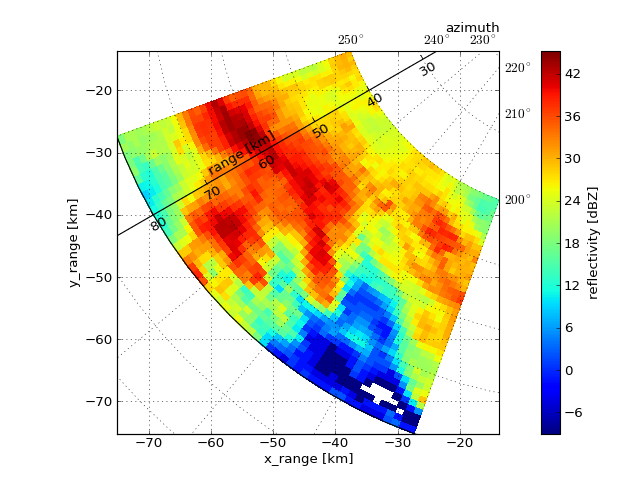

Towards Cross-Platform Weather Radar Science
============================================

...by introducing a community-based open Virtual Machine.
-------------------------------------------------------------

In recent years, various Open Source Software (OSS) tools have become available 
to the weather radar community (see `here <http://dx.doi.org/10.1175/BAMS-D-13-00240.1>`_).

On these pages, we present a Virtual Machine (VM) as a turn-key solution 
to run and combine a number of weather radar software packages in a single environment: 
reliable, reproducible, scalable, and extendable.

Quicklinks
----------

:doc:`Why should I use the VM? <background>`

:doc:`Get me started as quickly as possible! <quickstart>`

:doc:`Learn about the features of the VM! <features>`

.. toctree::
   :maxdepth: 1
   :hidden:
   
   background
   features
   quickstart
   downloads
   build
   courses
   community
   team
   knownissues
   

